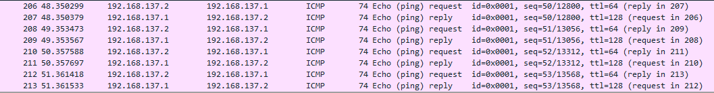
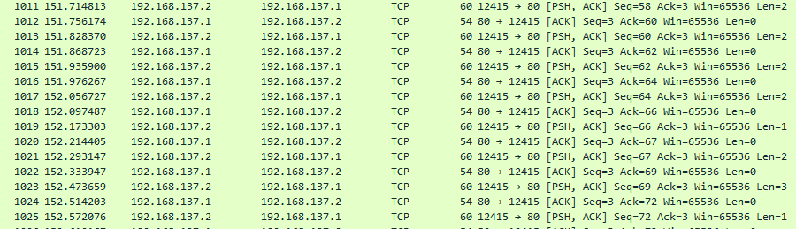
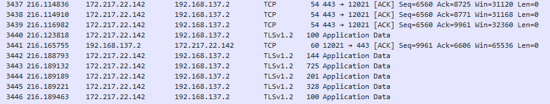

# TP 2 Réseaux
## I - Exploration locale en solo
### 1.Affichage d'informations sur la pile TCP/IP locale

Afficher nom, adresse MAC et adresse IP de l'interface WiFi et de l'interface ethernet
	~> taper dans le CLI : `ipconfig /all`
	
Wifi : 

	~> Nom :
	~> Adresse MAC : 30-E3-7A-EC-62-FB
	~> Adresse IP : 10.33.2.32
	~> Adresse du réseau : 10.33.0.0
	~> Adresse de broadcast : 10.33.3.255

Ethernet :

	~> Nom :
	~> Adresse MAC : 4C-CC-6A-85-68-DE
	~> Comme on utilise la carte Wifi, le carte Ethernet est désactivée, elle ne possède donc ni adresse IP, 
	ni adresse de réseau, et donc pas d'adresse de broadcast

Passerelle :
	On peut trouver la passerelle (Gateway) via la commande ipconfig /all utilisée dans un CLI.
	~> IP passerelle : 10.33.3.253

-----------------------------------------------------------------------------------------------
Afficher IP, MAC et Gateway via Graphical User Interface: 
	~>Il suffit de faire clic droit sur le bouton windows (en bas a gauche généralement) puis de cliquer sur connexions réseau. Ensuite, allez dans l'onglet "ÉTAT" puis cliquez sur affichez vos propriétés réseau et c'est gagné !

	~>Adresse IP : 10.33.2.32/22
	~>Adresse MAC : 30:e7:7a:ec:62:fb
	~>Gateway : 10.33.3.253

~>La Gateway (ou passerelle) sert a relier le réseau local d'ynov a Internet.

-----------------------------------------------------------------------------------------------
### 2.Modification des informations
#### A.Modification d'adresse IP - Pt.1
	Utilisez l'interface graphique de vorte OS pour changer d'adresse IP :
- calculez la première et la dernière IP du réseau
~> première 10.33.0.1
~> dernière 10.33.3.254

- changez l'adresse IP de votre carte WiFi pour une autre (mais toujours dans le même réseau)
~> Il suffit de faire clic droit sur le bouton windows (en bas a gauche généralement) puis de cliquer
sur connexions réseau. Ensuite, allez dans l'onglet "WIFI" et cliquez sur "Modifier les options d'adaptateur"
Une nouvelle page se présente, Clic droit sur "Wi-fi" et sélectionnez "Propriétés".
Encore une fois, une nouvelle fenêtre apparait, cliquez sur "Protocole Internet version 4 (TCP/IPv4) puis propriétés.
Choisissez "Utiliser l'adresse IP suivante : et modifiez comme bon vous semble.

Réponse : il suffit de mettre une adresse entre 10.33.0.1 et 10.33.3.254 

#### C.Modification d'adresse IP - Pt
nmap : Afin de scanner son réseau wifi, il suffit d'installer nmap et taper la commande "nmap -sP <adresse réseau>" dans mon cas :
`nmap10.33.0.0/22`

Je choisis mon adresse parmis celles de libre, met le masque et la gateway.

-----------------------------------------------------------------------------------------------
## II - Exploration locale en duo
### 3.Création du réseau & Modification de l'adresse IP
   Si l'on considère la création d'un réseau lorsqu'une communication parvient entre deux machines, alors une fois nos deux PC branchés entre eux via le cable RJ45 le "réseau" est créé. Pour que communication ait lieu, on définit manuellement une adresse IP sur les cartes Ethernet de nos machines afin qu'elles soient sur le même réseau. Par la suite, on teste que ces changements ont bien été pris en compte en utilisant un `ipconfig /all`, puis on teste le bon fonctionnement de la communication en effectuant un ping d'une machine à l'autre.

### 5.Petit chat privé ?
Une fois téléchargé et intallé sur chaque PC, on ouvre tout deux un CLI puis à l'aide de `cd <Nom_du_fichier>` afin de se trouver dans le dossier de NetCat. Une fois dedans, via le CMD, on utilise deux commandes différentes pour chaque rôle, le PC serveur utilisera la commande `nc -l -p <port_choisi>` alors que le PC client utilisera quand à lui la commande `nc <IP_serveur> <port_choisi>`.
La connexion enfin établie, on peut envoyer des messages d'un PC à l'autre, via l'interface CMD.

### 6.WireShark
Screenshots des trames observées pendant :
* Un ping :

* Une communication NetCat :

* L'utilisation d'internet par le PC sans carte Wifi :

### 7.Firewall
Afin d'autoriser le ping avec le Firewall de Windows activé, il faut entrer la commande ci-suivante sur le CMD : ``netsh advfirewall firewall add rule name="ICMP Allow incoming V4 echo request" protocol=icmpv4:8,any dir=in action=allow`
Pour pouvoir utiliser Netcat, on a du aller dans les options de pare-feu Windows afin d'activer le port 8888 en port local. Si le port de connexion du PC disant est inconnu, alors on autorise tous les ports en port distant.
